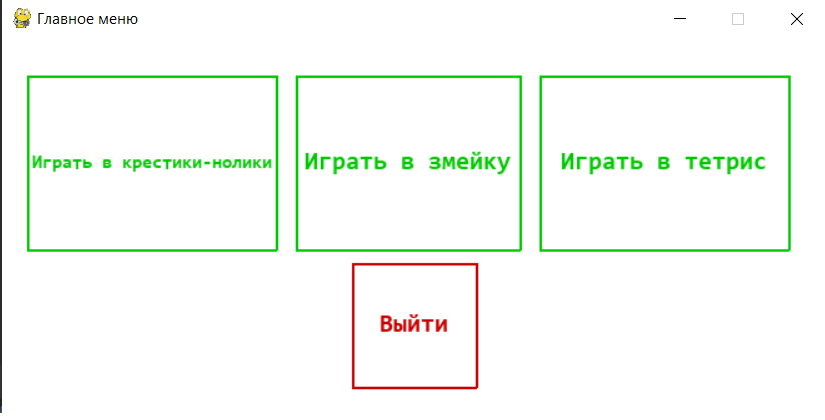
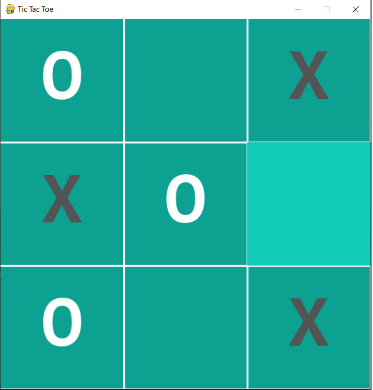
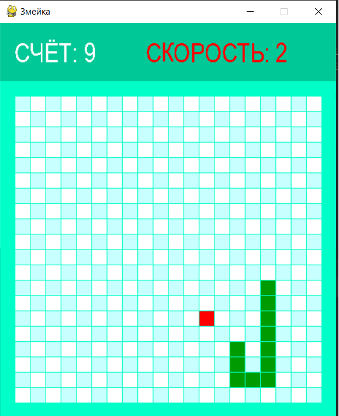
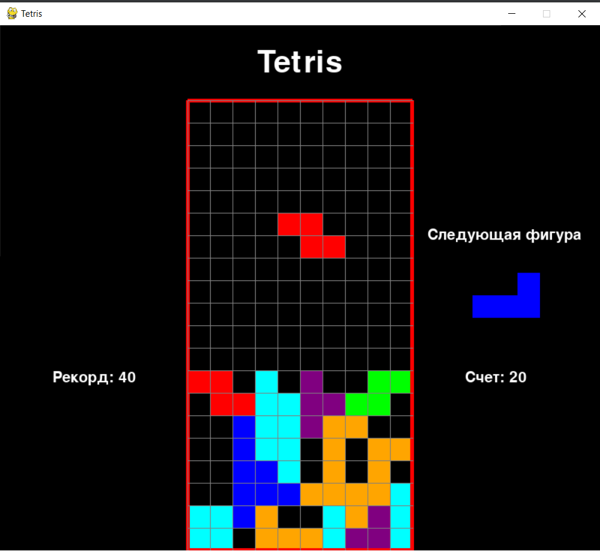

# PyGame_Minigames
Our project provides you with 3 popular games written only in python language using pygame library

## 1. Tic-Tac-Toe

## 2. Snake

## 3. Tetris

## Technologies
To create this project following libraries following technologies were used:
* [Pygame](https://www.pygame.org/)

## Authors

* **Rakhmetulla Akram** - [spike1236](https://github.com/spike1236)
* **Marat Daniel** - [MaratDaniel](https://github.com/maratdaniel)
* **Baimagambetov Beksultan** - [BeksultanBaimagambetov](https://github.com/beksultanbaimagambetov)

## License

This project is licensed under the MIT License - see the [LICENSE](LICENSE) file for details

## We are very grateful that you have visited our project and we will be very glad if you try to play our games!
